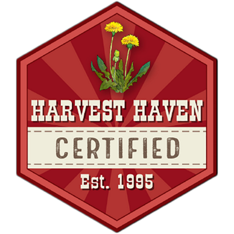

  <h1>
    Harvest Haven Learning App
  </h1>

  __An app for Harvest Haven's Learning Library with offline & mobile support__

  

# Getting Started

> Click on the description that best describes you!

### [Customer](#customer)

### [Owner]()

### [Coder](#developer)

# Customer

Hello there valued customer! If you are not very tech savy or you have never used this app before, we are here to help out as best as we possibly can. The Harvest Haven App has been developed with everyone we serve in mind and we want to help everyone to enjoy the same experience as much as possible.

- [__What Is This App?__](#whats-new?)
- [__Features__](#features)
- [__Is My Device Compatible?__](#how-to-install)
- [__How to Install__](#features)
- [__Using the App__](#how-to-install)

## What is this App?

The Harvest Haven App is a special website that can anyone can take with them whether you are on your computer, your tablet or phone. We chose not to go through the hurtles of mobile app development through Google and Apple and have put together something called a 'PWA', that allows us to share the same Harvest Haven experience with both desktop and mobile device users. It also makes it easier for us to keep the app updated and distributed for all. We hope you like it!

## Features

- Take Harvest Haven's full Store Experience with you.
- Watch videos about Grander, food production and health devices on the go.
- Save and download your favorite videos for when you don't have access to the internet.
- Have the ability to share what you have learned with your friends and neighbors in person.

## How To Install

  - [__In-Store__](#how-to-install)
    - [__Scanning The QR Code__](#how-to-install)
  - [__At Home__](#how-to-install)
    - [__Visiting the Website__](#how-to-install)
    - [__Device Helper__](#how-to-install)

Lorem ipsum dolor sit amet, consectetur adipiscing elit. Donec ullamcorper erat non orci cursus, vitae ultricies orci fermentum. Pellentesque aliquam, turpis in dictum auctor, risus ipsum rutrum magna, sit amet hendrerit elit nibh sit amet orci. Praesent aliquam scelerisque quam, vitae mollis nunc. Sed egestas mattis faucibus. Aenean eros arcu, dignissim sit amet dui commodo, sodales luctus dolor. Aenean eget leo neque. Proin pharetra facilisis magna, vitae dapibus arcu euismod a. Cras sem erat, tincidunt a consectetur et, elementum quis nisi. Vivamus vel consectetur dui, a suscipit quam. Suspendisse varius ante consequat neque tempor maximus. 

- [__Mobile__](#how-to-install)
- [__Desktop__](#how-to-install)

Phasellus nec purus porttitor, porttitor nunc non, mollis dui. Donec eleifend risus sed diam imperdiet rhoncus. Praesent pulvinar, dolor a ultrices venenatis, augue diam ornare mi, vitae laoreet elit nisi eu dui. Morbi ut nisi tristique, rhoncus est ut, hendrerit massa. Sed quis purus vestibulum, interdum enim quis, facilisis diam. Sed consequat, ex vel tempor sagittis, turpis eros consectetur justo, et rutrum nunc augue eu massa.

##### [[back to Customer]](#New-Customer)

## Device Install Guides

  - [__Mobile__](#how-to-install)
    - [__iPhone__](#how-to-install)
      - [__Safari__](#how-to-install)
      - [__Chrome__](#how-to-install)
      - [__Firefox__](#how-to-install)
    - [__Android__](#how-to-install)
      - [__Chrome__](#how-to-install)
      - [__Firefox__](#how-to-install)

##### [[back to Customer]](#New-Customer)

---

# Developer

__This is the [developer]() section and is NOT for the faint of heart or for our valued customers. If you are one of these, click here to [go back to safety!](#customer)__

---

> __Note for all developers:__ If you are having trouble of any kind, tag [Braden](https://github.com/Braden-Preston) or [Michael](https://github.com/MikePreston17) or submit an issue to the [repo](https://github.com/HarvestHaven/Harvest-Haven-Store/issues).

### Navigation

- [__Basic Information__](#basic-information)
- [__Development Tools__](#development-tools)
- [__Quick Start__](#quick-start)
- [__Required Features__](#required-features)
- [__Package Purposes__](#packages)
- [__Application Lifecycle__](#application-lifecycle)

---

## Basic Information

This application is a PWA (Progressive Website Application) that is developed in JavaScript using the Node Framework. It employs a serverless stack that is most closely aligned with the MERN stack.

It was boostrapped with [Create React App 2.0](https://facebook.github.io/create-react-app/). CRA has been rewired so that its configuration is  accessible by [craco](https://www.npmjs.com/package/@craco/craco), This allows us to tweak and add additional functionality into the default Webpack configuration. [Webpack](https://webpack.js.org/) in CRA is responsible for bundling, linting, shaking and splitting code for making the app as lightweight as possible.

The PWA also employs an experimental service worker using Google's [Workbox](https://developers.google.com/web/tools/workbox/) to enable offline support for users where it is possible. Offline support is satisfied by [IndexedDB](https://caniuse.com/#feat=indexeddb) with fallbacks for [WebSQL](https://caniuse.com/#search=websql), and [LocalStorage](https://caniuse.com/#search=localstorage), depending on the user's device.

> This app is still [experimental](), so some of these features may change as the application or device support changes. Features have been selected to be as future-proof as possible with fallbacks at the expense of bundle size and speed.

---

## Development Tools

TBA

We are using VSCode! :)

##### [[back to Developer Navigation]](#navigation)

---

## Quick Start

Once you have cloned the repository from the [repo](https://github.com/HarvestHaven/Harvest-Haven-Store/issues), open the root directory in VSCode. You should have access the `public` and `src` folders. Make sure you are cd'd properly into this directory before you try to run any commands.

We are using [yarn](https://yarnpkg.com/en/) as our package manger, but you may use `npm` or `npx` as desired, just make sure you prepend your command with 'run'.

| Package Manager | Command |
| --- | --- |
| **`yarn`** | `yarn` test |
| **`npm`** | `npm` run test |
| **`npx`** | `npx` run test |

See [Migrating from NPM](https://yarnpkg.com/lang/en/docs/migrating-from-npm/).

---

## Install

This is the first command you should run after cloning the repo. It will build the `node_modules` directory and download all necessary packages needed for development as specified in [package.json](https://github.com/HarvestHaven/Harvest-Haven-Store/blob/master/package.json).

    yarn install

## Start

Runs the application in `development` mode but [does not attach the service worker](). This mode is perfect for UI and UX development, but not for adjusting service worker or caching functionality. Run and serve a static [build](#build) for that.

    yarn start

> View app in browser at [localhost:3000](http://localhost:3000/)

## Build

Runs the application in `production` mode and is optimized for performance, as it has been bundled and cleaned by `Webpack`. It is served locally and a service worker is attached using `Workbox`

    yarn build

> View app in browser at [localhost:5000](http://localhost:5000/)

## 

## Deploy

Triggers a build on [Netlify](https://www.netlify.com/) and / or [Heroku](https://www.netlify.com/). Netlify will monitor the repo and on pushes to the working branch will package, bundle, clean and host the app on their servers.

    yarn deploy

> View app in browser at [hhstore.netlify.com](http://www.hhstore.netlify.com/) or [hhstore.herokuapp.com](http://www.hhstore.herokuapp.com/)

## Test

Runs the application in `test` mode. CRA by default uses [jest]() at its test runner. See [Running Tests](https://facebook.github.io/create-react-app/docs/running-tests).

    yarn test

## Other Commands

Less used but still important to development are the following: 

| Command | Purpose |
| --- | --- | 
| `serve` | Quickly host the contents of the `build` director at [localhost:5000](http://localhost:5000/)|
| `build-storybook` | Takes your storybook and builds a static site that can be served|
| `eject` | **NEVER** use this! Use at your own [risk!](https://facebook.github.io/create-react-app/docs/alternatives-to-ejecting) |

##### [[back to Developer Navigation]](#navigation)

---

## Required Features

The following features are required to create the minimum viable product as requested by the Harvest Haven owners:

- [x] The app needs to be installable on Desktop and have the ability to be ran as an executable. The operating system will be either Windows or OSX. The app should be able to run on startup and at certain times via a scheduler.
- [ ] The app should be simple enough that one of the Harvest Haven kids are able to relaunch it if they are passing by and have noticed it isn't working properly.
- [ ] The app needs to be have an active service worker for offline / online support, or it should be completely offline with only local storage.
- [ ] The app will need to store video content locally to be retrieved as instantaneously as possible. There should be minimimal load time for each resource.
- [x] This will require the use of either local storage (Electron) or persistant browser storage (LocalForage)
- [ ] Harvest Haven will have access to some features that others may not through authentication in [Firebase](), such as:
  - [ ] Editing the manifest to update gallery contents, playlists, & video descriptions. This may be accomplished in a separate tool via [Toolbox]()
  - [ ] Adjusting store-only preferences, such as color theme, font-size, display mode, and kiosk-only UI features.
  - [ ] Administrative tools for downloading the entire video library for offline use.
- The app should first and foremost be **made to serve the owners of Harvest Haven**. Every priority will be given to them first and their request of necessary features overrides the desires of the customer to ensure that Harvest Haven has the most stable and robust version of the app.

###

##### [[back to Developer Navigation]](#navigation)

---

## Packages

### Default

| Package | Version | Purpose |
| --- | --- | --- | 
| [`@craco/craco`](https://www.npmjs.com/package/@craco/craco) | ^4.0.1 | Overrides CRA /  `react-scripts`'s configuration file to allow custom Webpack and ESLint configurations |
| [`@material-ui/core`](https://www.npmjs.com/package/@material-ui/core) | ^3.9.3 | Most used staple components for React UI development |
| [`@material-ui/icons`](https://www.npmjs.com/package/@material-ui/icons) | ^3.0.2 | Large package containing Material Design Icons |
| [`@material-ui/styles`](https://www.npmjs.com/package/@material-ui/styles) | ^3.0.0-alpha.10 | Material-UI's custom implementation of JSS among other feature support such as `styled-components` |
| [`@material-ui/system`](https://www.npmjs.com/package/@material-ui/system) | ^3.0.0-alpha.2 | Experimental but extremely useful component composition helper library. |
| [`localforage`](https://www.npmjs.com/package/localforage) | ^1.7.3 | IndexdedDB storage simplified, with fallback for other persistant browser storage types |
| [`mobx`](https://www.npmjs.com/package/mobx) | ^5.9.0 | Property access management library for implementing reactive components & observable states |
| [`mobx-react`](https://www.npmjs.com/package/`mobx-react) | ^5.4.3 | React style bindings for MobX, such as `@inject` and `@observer` |
| [`react`](https://www.npmjs.com/package/react) | ^16.8.6 | Efficient Virtual DOM managmeent library for class based UI components |
| [`react-dom`](https://www.npmjs.com/package/react-dom) | ^16.8.6 | Render compoents manually to browser DOM without exisiting React DOM |
| [`react-router-dom`](https://www.npmjs.com/package/react-router-dom) | ^5.0.0 | Simplified bindings for react-router, such as `BrowserRouter` |
| [`react-scripts`](https://www.npmjs.com/package/react-scripts) | 2.1.8 | Create React App's bundled collection of scripts for development and production |
| [`styled-components`](https://www.npmjs.com/package/styled-components) | ^4.2.0 | JSS to CSS mapper to convert JS code into CSS classes dynamically |
<!-- 
| [``]() |  |  | -->

### Dev Dependencies

| Package | Version | Purpose |
| --- | --- | --- |
| [`@babel/plugin-proposal-decorators`](https://www.npmjs.com/package/@babel/plugin-proposal-decorators) | ^7.4.0 | Webpack plugin that adds support for decorators in Typescript and MobX |
| [`@storybook/addon-actions`](https://www.npmjs.com/package/@storybook/addon-actions) | ^5.0.5 | Adds a panel to call synthetic actions within your stories |
| [`@storybook/addon-console`](https://www.npmjs.com/package/@storybook/addon-console) | ^1.1.0 | Enables `console.log()` output in storybook drawer |
| [`@storybook/addon-knobs`](https://www.npmjs.com/package/@storybook/addon-knobs) | ^5.0.5 | Enables UI to control story props passed to React components |
| [`@storybook/addon-viewport`](https://www.npmjs.com/package/@storybook/addon-viewport) | ^5.0.5 | Simulate different device resolutions inside storybook |
| [`@storybook/addons`](https://www.npmjs.com/package/@storybook/addons) | ^5.0.5 | Enable addon support for storybook |
| [`@storybook/react`](https://www.npmjs.com/package/@storybook/react) | ^5.0.5 | Support for React components inside storybook |
| [`craco-workbox`](https://www.npmjs.com/package/craco-workbox) | ^0.1.0 | Craco plugin for overriding the [GenerateSW](https://developers.google.com/web/tools/workbox/modules/workbox-webpack-plugin#generatesw_plugin_1) configuration for CRA's `webpack-workbox-plugin` |
| [`storybook-addon-material-ui`](https://www.npmjs.com/package/storybook-addon-material-ui) |  | 
Adjust MUI color palettes with detailed UI on the fly and wrap stories in &lt;Provider /&gt;<blockquote>Note: This cannot be implemented until it supports storybook 5.0 :(</blockquote>
 |
| [`workbox-cli`](https://www.npmjs.com/package/workbox-cli) | ^4.2.0 | Create a custom service worker & implement default strategies for offline support |
<!-- 
| [``]() |  |  | -->

##### [[back to Developer Navigation]](#navigation)

<!-- - [__Required Features__](#development)
- [__Package Purposes__](#development) -->

## Application Lifecycle

##### [[back to Developer Navigation]](#navigation)
